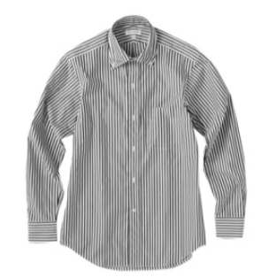

name: inverse
layout: true
class: center, middle, inverse

---

# ディープラーニングとは何か分かってないけど画像分類してみた。

ITエンジニアのためのDeepLearning 番外編 LT  
山内 雅浩  
.blue-text[@algas]

---

layout: false

# Agenda

1. 背景
2. 入力画像
3. 分類結果
4. 考察
5. ディープラーニングについての所感
6. 自己紹介

---

## 背景

ファッション系のアプリを開発運営する会社で働いているので、  
Deep Learning で洋服の画像を自動分類できるか試してみました。  
ユーザが自分の服やコーディネートの写真をアップロードできるサービスですが、  
自分の持っている服のカテゴリを決めるのは意外と難しいものです。  
服のカテゴリの自動判定ができればサービス改善に繋がると思い、  
研究開発として自動分類を試してみました。  

---

class: center, middle

# そうじゃない

---

class: center, middle

### 本当は
### 「ディープラーニングを使ってみた(ドヤっ」
### って言いたかっただけ！

---

## 入力画像

各画像セットにつき50枚ずつ

- パーカー (フード有り 長袖)
- ベスト (袖なし) 
- Tシャツ (襟無し 半袖) 
- Yシャツ (襟有り 長袖) 

Deep Learning の知識がなさすぎるので簡単お手軽な画像分類サービス  
Labell.io を使って分類してみることにしました。  

--

.cloth[

]

上記はテスト画像の一例です。

---

## 分類結果

各画像セットにつき50枚ずつ

- パーカー (フード有り 長袖) : .blue-text[98.9%]

--

- ベスト  (袖なし)         : .blue-text[98.7%]

--

- Tシャツ (襟無し 半袖)     : .blue-text[95.9%]

--

- Yシャツ (襟有り 長袖)     : .red-text[69.3%] ←これだけ低い

--

.red-text[Yシャツの分類精度だけが極端に悪い。]  
訓練画像の枚数が少なかったのかも。素材のデータにチェック柄のシャツが多かったので、過学習に陥ったのか？

---

## 考察

- 画像を集めてカテゴライズするのが大変で、今回の作業のほとんどの時間はそれに費やされています。（分類だけで半日以上かかった）
- Labellio は良くも悪くも学習について何も設定できません。
- tensorflow も触ってみた。CPUだけで動かすとチュートリアルの訓練だけで数日かかったことに絶望した！（途中で諦めた）
- 例えば tensorflow などで同様の画像分類をする場合、どのように始めればいいのでしょうか？ 教えて偉い人！

＊画像分類の仕組みについては詳細を理解していないので  
技術的な質問にはお答えできません！

---

### ディープラーニングのイケてないところ

--

「データを収集・前処理する作業が一番大変で時間がかかる」
- データ分析一般に共通することではありますが・・・
- 画像を分類したりnormarizeしたり
- メインの分析に移る前にリソース不足により挫折しがち

--

「分析・分類の精度が低い場合に改善する方法を発見しづらい」
- そもそも問題の切り分けが難しい
- 切り分けができても試行錯誤に時間がかかりすぎる
- したがってリソース投下などの経営判断をするのも難しい

--

### でも使えるようになりたいです！

---

## 自己紹介

山内 雅浩  
.blue-text[@algas] (github, qiita, twitter)  
株式会社スタイルレシピ 執行役員 CTO

スマホ向けアプリやWebの開発と開発チーム運営が主な仕事です。  
会社のサービスは ionic と clojure で書いてます。  
個人的は Python とか Haskell で web を書いたりします。  
人工衛星からゲームの開発まで幅広く開発経験があります。  

---

class: center, middle

## ご清聴ありがとうございました！
